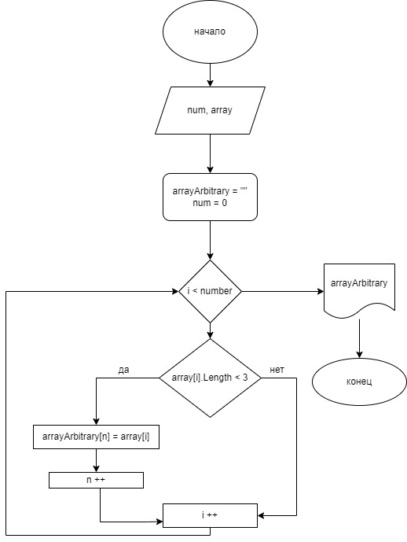

# **Решение контрольной работы** 

## блок Схема:

## Описание программы
* Пишем функции которая будет запрашивать длину массива *(функция ArrayArbitrary)*
* Внутри функции проверяем колличество значений в элементе массива
* Пишем вторую функцию, которая будет проверять что бы мы не вышли за длину массива *(PrintArray)*

* Выводим решение в в печать, где: 
1. Программа попросить ввести длину массива
2. Программа попросит ввести элементы массива ***(т.к. тип данных string - элементы массива могут быть как числовые, так и текстовые)***
3. Программа выводит в консоль ве элементы массива, в которых кол-во значений менее или равно 3.

